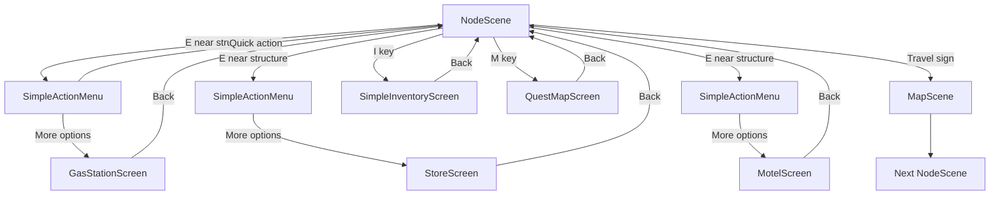

# UI Components Specification - Детальная Спецификация

## 🎨 Визуальный Стиль (Consistency Guide)

### Цветовая Схема
```cpp
// Primary Colors
const sf::Color BACKGROUND_DARK(40, 40, 50);      // Тёмный фон
const sf::Color BACKGROUND_LIGHT(60, 60, 70);     // Светлый фон
const sf::Color ACCENT_BLUE(70, 130, 180);        // Синий акцент
const sf::Color ACCENT_GREEN(60, 180, 75);        // Зелёный (успех)
const sf::Color ACCENT_RED(220, 50, 50);          // Красный (опасность)
const sf::Color ACCENT_YELLOW(255, 200, 50);      // Жёлтый (предупреждение)

// UI Elements
const sf::Color BUTTON_NORMAL(80, 80, 90);
const sf::Color BUTTON_HOVER(100, 100, 110);
const sf::Color BUTTON_PRESSED(60, 60, 70);
const sf::Color TEXT_PRIMARY(255, 255, 255);
const sf::Color TEXT_SECONDARY(200, 200, 200);
const sf::Color BORDER_COLOR(150, 150, 160);
```

### Шрифты и Размеры
```cpp
const unsigned int FONT_SIZE_TITLE = 32;
const unsigned int FONT_SIZE_SUBTITLE = 24;
const unsigned int FONT_SIZE_NORMAL = 18;
const unsigned int FONT_SIZE_SMALL = 14;

const float PADDING_LARGE = 20.0f;
const float PADDING_MEDIUM = 10.0f;
const float PADDING_SMALL = 5.0f;

const float BUTTON_HEIGHT = 40.0f;
const float BUTTON_MIN_WIDTH = 120.0f;
```

---

## 🎯 SimpleActionMenu - Детальная Реализация

### Структура данных

```cpp
// SimpleActionMenu.h
#ifndef SIMPLE_ACTION_MENU_H
#define SIMPLE_ACTION_MENU_H

#include <SFML/Graphics.hpp>
#include <string>
#include <vector>
#include <functional>

// Action callback type
using ActionCallback = std::function<void()>;

struct MenuAction {
    std::string text;           // Отображаемый текст
    std::string id;             // Уникальный ID действия
    bool enabled;               // Доступно ли действие
    int cost;                   // Стоимость (-1 если бесплатно)
    ActionCallback callback;    // Что выполнить
    
    MenuAction(const std::string& t, const std::string& i, 
               bool e = true, int c = -1)
        : text(t), id(i), enabled(e), cost(c) {}
};

class SimpleActionMenu {
public:
    SimpleActionMenu();
    ~SimpleActionMenu() = default;
    
    // Setup and display
    void show(const std::vector<MenuAction>& actions, 
              const std::string& title = "Actions");
    void hide();
    bool isVisible() const { return m_visible; }
    
    // Input handling
    void handleInput(const sf::Event& event);
    void update(float deltaTime);
    
    // Rendering
    void render(sf::RenderWindow& window);
    
    // Position on screen
    void setPosition(float x, float y);
    
private:
    bool m_visible;
    std::vector<MenuAction> m_actions;
    int m_selectedIndex;
    std::string m_title;
    
    // Position
    sf::Vector2f m_position;
    float m_width;
    float m_height;
    
    // Visual elements
    sf::RectangleShape m_background;
    sf::RectangleShape m_border;
    sf::RectangleShape m_titleBar;
    sf::Text m_titleText;
    std::vector<sf::RectangleShape> m_actionBackgrounds;
    std::vector<sf::Text> m_actionTexts;
    sf::Font m_font;
    
    // Helper methods
    void calculateDimensions();
    void updateVisuals();
    void selectPrevious();
    void selectNext();
    void executeSelected();
    void loadFont();
};

#endif // SIMPLE_ACTION_MENU_H
```

### Визуальное представление

```
┌─────────────────────────────────┐
│ ⛽ GAS STATION         [X]      │ ← Title Bar (темнее)
├─────────────────────────────────┤
│                                 │
│ ┌─────────────────────────────┐ │
│ │ > Refuel ($50)              │ │ ← Selected (подсветка)
│ └─────────────────────────────┘ │
│                                 │
│ ┌─────────────────────────────┐ │
│ │   Buy Snacks ($15)          │ │ ← Normal
│ └─────────────────────────────┘ │
│                                 │
│ ┌─────────────────────────────┐ │
│ │   Use Restroom (Free)       │ │
│ └─────────────────────────────┘ │
│                                 │
│ ┌─────────────────────────────┐ │
│ │   More Options →            │ │ ← Переход к экрану
│ └─────────────────────────────┘ │
│                                 │
│   [↑↓: Select] [Enter] [ESC]   │ ← Hint
└─────────────────────────────────┘
```

### Использование в NodeScene

```cpp
// В NodeScene.h добавляем:
class NodeScene : public Scene {
private:
    // ... existing members
    SimpleActionMenu m_actionMenu;
    bool m_showingMenu;
    
    void showStructureMenu(Structure* structure);
    void handleMenuAction(const std::string& actionId);
};

// В NodeScene.cpp:
void NodeScene::handleInput(const sf::Event& event) {
    // If menu is showing, handle menu input first
    if (m_actionMenu.isVisible()) {
        m_actionMenu.handleInput(event);
        return;
    }
    
    // Normal gameplay input...
    if (event.type == sf::Event::KeyPressed) {
        if (event.key.code == sf::Keyboard::E) {
            if (m_nearbyStructure) {
                showStructureMenu(m_nearbyStructure);
            }
        }
        // ... other keys
    }
}

void NodeScene::showStructureMenu(Structure* structure) {
    std::vector<MenuAction> actions;
    
    switch (structure->getType()) {
        case LocationType::GAS_STATION:
            actions.push_back(MenuAction(
                "Refuel ($50)", 
                "refuel",
                playerState.getMoney() >= 50,
                50
            ));
            actions.push_back(MenuAction(
                "Buy Snacks ($15)", 
                "buy_snacks",
                playerState.getMoney() >= 15,
                15
            ));
            actions.push_back(MenuAction(
                "More Options →", 
                "open_gas_screen"
            ));
            break;
            
        case LocationType::STORE:
            // ... similar pattern
            break;
    }
    
    // Show menu centered on screen
    m_actionMenu.show(actions, structure->getName());
    m_actionMenu.setPosition(300.0f, 200.0f);
}

void NodeScene::update(float deltaTime) {
    if (m_actionMenu.isVisible()) {
        m_actionMenu.update(deltaTime);
        return;
    }
    
    // Normal gameplay update...
}

void NodeScene::render(sf::RenderWindow& window) {
    // Normal rendering...
    
    // Render menu on top
    if (m_actionMenu.isVisible()) {
        m_actionMenu.render(window);
    }
}
```

---

## 📄 SimpleScreen Base Class

```cpp
// SimpleScreen.h
#ifndef SIMPLE_SCREEN_H
#define SIMPLE_SCREEN_H

#include "Scene.h"
#include <SFML/Graphics.hpp>
#include <vector>
#include <string>

class SimpleScreen : public Scene {
public:
    SimpleScreen();
    virtual ~SimpleScreen() = default;
    
    void handleInput(const sf::Event& event) override;
    void update(float deltaTime) override;
    void render(sf::RenderWindow& window) override;
    
    SceneType getNextScene() const override { return m_nextScene; }
    bool isFinished() const override { return m_finished; }
    
protected:
    // Button helper struct
    struct Button {
        sf::RectangleShape shape;
        sf::Text text;
        std::string id;
        bool hovered;
        bool enabled;
        int cost;  // -1 if free
        
        Button(const std::string& btnId, const std::string& btnText,
               sf::Vector2f pos, sf::Vector2f size);
        
        bool contains(sf::Vector2f mousePos) const;
        void setHover(bool hover);
        void render(sf::RenderWindow& window);
    };
    
    // Item display helper
    struct ItemDisplay {
        std::string name;
        std::string description;
        int price;
        sf::Sprite icon;  // Optional
        sf::Vector2f position;
        
        void render(sf::RenderWindow& window, const sf::Font& font);
    };
    
    // Scene state
    bool m_finished;
    SceneType m_nextScene;
    
    // Visual elements
    sf::Font m_font;
    sf::Text m_titleText;
    sf::RectangleShape m_background;
    std::vector<Button> m_buttons;
    
    // Helper methods
    void createTitle(const std::string& title);
    Button* createButton(const std::string& id, const std::string& text,
                        float x, float y, float width = 200.0f);
    Button* getHoveredButton(sf::Vector2f mousePos);
    Button* getButton(const std::string& id);
    
    // Override these in derived classes
    virtual void onButtonClick(const std::string& buttonId) = 0;
    virtual void onBack();
    
    void loadFont();
    void renderButtons(sf::RenderWindow& window);
};

#endif // SIMPLE_SCREEN_H
```

---

## 🏪 Store Screen Example

```cpp
// StoreScreen.h
class StoreScreen : public SimpleScreen {
public:
    StoreScreen();
    
    void update(float deltaTime) override;
    void render(sf::RenderWindow& window) override;
    
protected:
    void onButtonClick(const std::string& buttonId) override;
    
private:
    struct StoreItem {
        std::string id;
        std::string name;
        std::string description;
        int price;
        float weight;
    };
    
    std::vector<StoreItem> m_items;
    int m_currentPage;
    int m_itemsPerPage;
    
    void initializeItems();
    void createPageButtons();
    void buyItem(const std::string& itemId);
    void nextPage();
    void prevPage();
    void updateItemDisplay();
};

// StoreScreen.cpp
StoreScreen::StoreScreen() 
    : SimpleScreen(),
      m_currentPage(0),
      m_itemsPerPage(5) {
    
    createTitle("🏪 Roadside Store");
    initializeItems();
    createPageButtons();
    updateItemDisplay();
    
    // Create navigation buttons
    createButton("prev", "◄ Previous", 100.0f, 500.0f, 150.0f);
    createButton("next", "Next ►", 350.0f, 500.0f, 150.0f);
    createButton("back", "Back to Road", 550.0f, 500.0f, 200.0f);
}

void StoreScreen::initializeItems() {
    m_items = {
        {"food", "Food Can", "Restores hunger", 15, 0.5f},
        {"water", "Water Bottle", "Restores thirst", 10, 1.0f},
        {"medicine", "First Aid Kit", "Restores 50 HP", 25, 0.8f},
        {"fuel_can", "Fuel Canister", "+20L fuel", 30, 3.5f},
        {"tool", "Basic Tool Kit", "For repairs", 50, 2.5f},
        // ... more items
    };
}

void StoreScreen::onButtonClick(const std::string& buttonId) {
    if (buttonId.find("buy_") == 0) {
        std::string itemId = buttonId.substr(4);
        buyItem(itemId);
    }
    else if (buttonId == "next") {
        nextPage();
    }
    else if (buttonId == "prev") {
        prevPage();
    }
    else if (buttonId == "back") {
        m_finished = true;
        m_nextScene = SceneType::NODE;
    }
}

void StoreScreen::buyItem(const std::string& itemId) {
    PlayerState& player = GameStateManager::getInstance().getPlayerState();
    
    // Find item
    auto it = std::find_if(m_items.begin(), m_items.end(),
        [&](const StoreItem& item) { return item.id == itemId; });
    
    if (it != m_items.end()) {
        if (player.getMoney() >= it->price) {
            // Check inventory space
            // ... inventory logic
            
            player.modifyMoney(-it->price);
            // Add item to inventory
            
            std::cout << "Bought: " << it->name << std::endl;
        } else {
            std::cout << "Not enough money!" << std::endl;
        }
    }
}
```

---

## 🗺️ Quest Map Screen Layout

```
┌────────────────────────────────────────────┐
│  🗺️  Quest & Travel Map                    │
├────────────────────────────────────────────┤
│                                            │
│  ══ ACTIVE QUESTS ══                       │
│  ┌──────────────────────────────────────┐ │
│  │ ✓ Main Quest: Find Lost Package     │ │
│  │   Progress: 2/3 items                │ │
│  │   [View Details]                     │ │
│  └──────────────────────────────────────┘ │
│                                            │
│  ══ AVAILABLE QUESTS ══                    │
│  ┌──────────────────────────────────────┐ │
│  │ • Help the Mechanic                  │ │
│  │   Reward: $100, Repair -20%          │ │
│  │   [Accept] [View]                    │ │
│  └──────────────────────────────────────┘ │
│                                            │
│  ┌──────────────────────────────────────┐ │
│  │ • Deliver Medicine                   │ │
│  │   Reward: $50, +Reputation           │ │
│  │   [Accept] [View]                    │ │
│  └──────────────────────────────────────┘ │
│                                            │
│  ────────────────────────────────          │
│  📍 Next Stop: Desert Town (150km)        │
│  Fuel needed: ~30L                         │
│  [Continue Journey] [Stay Here]            │
│                                            │
│  [Back]                   Quests: 1/5      │
└────────────────────────────────────────────┘
```

---

## 🎒 Simple Inventory Screen Layout

```
┌────────────────────────────────────────────┐
│  🎒 Inventory                              │
├────────────────────────────────────────────┤
│  Cargo: 15.5 / 64 kg      Page: 1/2       │
│                                            │
│  ┌──────────────────────────────────────┐ │
│  │ 🍔 Food Can                      x3  │ │
│  │ Restores hunger                      │ │
│  │ Weight: 0.5kg each                   │ │
│  │ [Use] [Drop]                         │ │
│  └──────────────────────────────────────┘ │
│                                            │
│  ┌──────────────────────────────────────┐ │
│  │ 💧 Water Bottle                  x2  │ │
│  │ Restores thirst                      │ │
│  │ Weight: 1.0kg each                   │ │
│  │ [Use] [Drop]                         │ │
│  └──────────────────────────────────────┘ │
│                                            │
│  ┌──────────────────────────────────────┐ │
│  │ 💊 First Aid Kit                 x1  │ │
│  │ Restores 50 HP                       │ │
│  │ Weight: 0.8kg                        │ │
│  │ [Use] [Drop]                         │ │
│  └──────────────────────────────────────┘ │
│                                            │
│  [◄ Prev] [Sort by Name ▼] [Next ►]      │
│  [Back to Game]           Items: 6        │
└────────────────────────────────────────────┘
```

---

## 🔄 Scene Transitions Flow



---

## ✅ Implementation Checklist

### 1. SimpleActionMenu (Priority: HIGHEST)
- [ ] Create header file
- [ ] Implement constructor/destructor
- [ ] Implement show/hide methods
- [ ] Implement input handling (arrows, numbers, Enter, ESC)
- [ ] Implement rendering with selection highlight
- [ ] Add to NodeScene
- [ ] Test with all structure types

### 2. SimpleScreen Base Class
- [ ] Create header file
- [ ] Implement Button struct
- [ ] Implement base rendering
- [ ] Implement mouse/keyboard input
- [ ] Add helper methods
- [ ] Test base functionality

### 3. Structure Screens
- [ ] GasStationScreen implementation
- [ ] StoreScreen with pagination
- [ ] MotelScreen with rest options
- [ ] Test all screens

### 4. Quest & Inventory
- [ ] QuestMapScreen
- [ ] SimpleInventoryScreen
- [ ] Integration testing

### 5. Cleanup
- [ ] Remove LocationScene files
- [ ] Update SceneManager
- [ ] Update CMakeLists.txt
- [ ] Final testing

---

**Status: Ready for implementation**
**Estimated time: 6-8 hours total**
**Priority: Critical for release**
